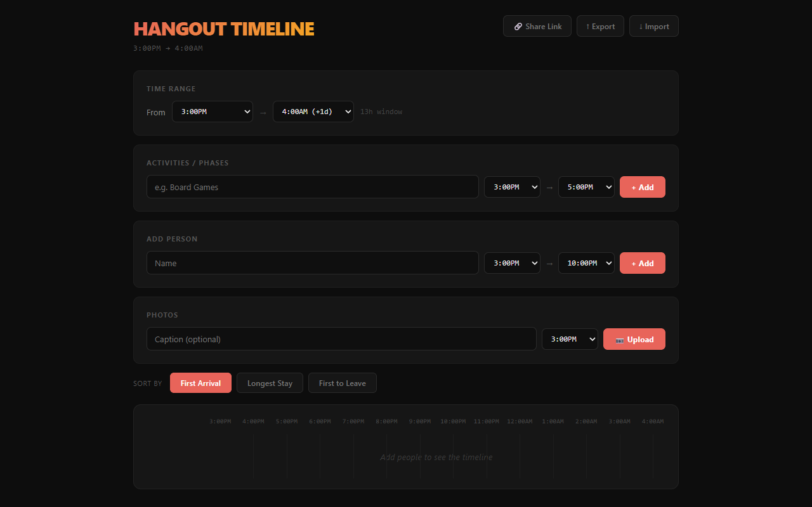
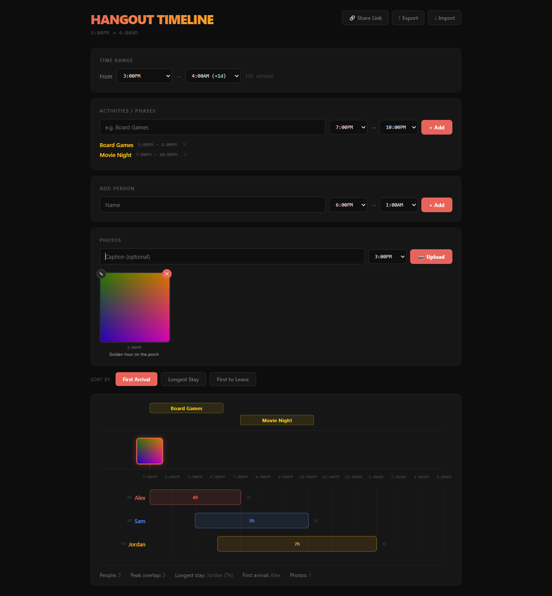
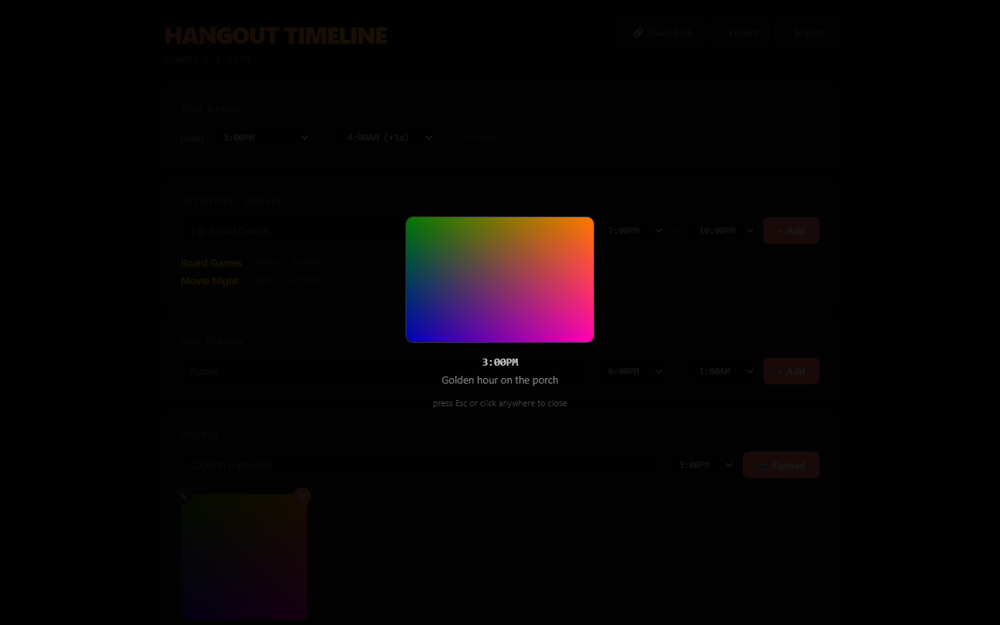

# Hangout Timeline

I wanted a neat way to organize data about hangouts I go on — who showed up, when they arrived and left, what we were doing, and photos from the night. Nothing I found did exactly that, so I built this.

**Live at [hangout-timeline.vercel.app](https://hangout-timeline.vercel.app/)**







## What it does

- **People timeline** — Add names with arrival/departure times and see them as color-coded bars on a 3PM–4AM timeline. Drag the edges of any bar to adjust times after the fact.
- **Activities** — Label phases of the hangout (e.g. "Board Games 3–6PM", "Movie 6–9PM") and they show up as gold bars above the people timeline.
- **Photos** — Upload pictures pinned to specific times. They appear as thumbnails on the timeline and open in a lightbox when clicked.
- **Sorting** — Toggle between "First Appearance" (who showed up earliest) and "Longest Stay" (who hung out the longest).
- **Stats** — See headcount, peak overlap, longest stay, and photo count at a glance.

Everything runs client-side — no accounts, no backend, no data stored anywhere.

## Running locally

```bash
npm install
npm run dev
```
